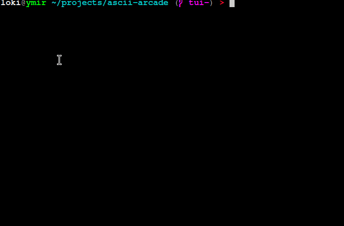

# AsciiArcade

> [!WARNING]
> 🚧 Work In Progress 🚧

`cargo run`

## Games

`Sandbox`

`move player (wasd), spawn entity (LMB), exit (q)`

### References
- [Ericson, Christer. Real-time collision detection. Crc Press, 2004.](https://www.sciencedirect.com/book/9781558607323/real-time-collision-detection)
    - [Ch5 - Basic Primitive Tests](https://www.sciencedirect.com/science/article/abs/pii/B9781558607323500103)
- [ANSI Escape Sequences](https://gist.github.com/fnky/458719343aabd01cfb17a3a4f7296797)
