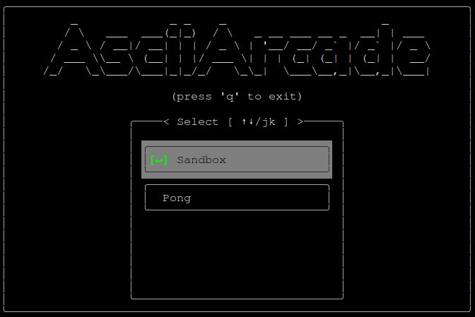
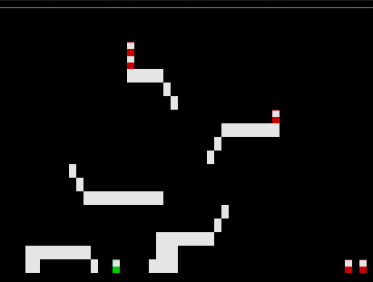

# AsciiArcade

This is a simple 2D physics engine incorporating a TUI (_Terminal User Interface_) frontend.
The TUI showcases the physics engine through various ascii arcade games.

> [!WARNING]
> 🚧 **WORK IN PROGRESS** 🚧
>
> Development requires the following dependencies (non-exhaustive):
> ```text
> rustup 1.28.1 (2025-03-05)
> cargo 1.85.1 (d73d2caf9 2024-12-31)
> rustc 1.85.1 (4eb161250 2025-03-15)
> ```

To run the application, execute the following command in your favorite terminal:

```bash
cargo run
```



### Games

This section overviews all games that are currently implemented. \
These commands can be run at any time:

```
return to menu (ESC)
exit (q)
```

#### Sandbox



```text
move player (wasd)
spawn collision entity (LMB)
spawn static entity (RMB)
```

### Utils
Additional utilities are provided with this repo to aid development.

- `./check.sh`: run CI pipeline (formatters/linters/unit-tests)
- `./dbg.sh`: a facile debugging utility that can be hooked into a running process (uses gdb)
