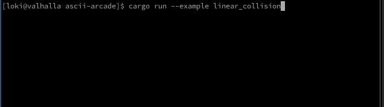

```
    _             _ _    _                      _
   / \   ___  ___(_|_)  / \   _ __ ___ __ _  __| | ___
  / _ \ / __|/ __| | | / _ \ | '__/ __/ _` |/ _` |/ _ \
 / ___ \\__ \ (__| | |/ ___ \| | | (_| (_| | (_| |  __/
/_/   \_\___/\___|_|_/_/   \_\_|  \___\__,_|\__,_|\___|
```

> [!NOTE]
> 🚧 Work In Progress 🚧

### Demos

| `linear_collision` |
| --- |
|  | 
| (execute) `cargo run --example linear_collision` |
| (controls) `move player (wasd), spawn entity (LMB), exit (q)` |

### References
- [Ericson, Christer. Real-time collision detection. Crc Press, 2004.](https://www.sciencedirect.com/book/9781558607323/real-time-collision-detection)
    - [Ch5 - Basic Primitive Tests](https://www.sciencedirect.com/science/article/abs/pii/B9781558607323500103)
- [ANSI Escape Sequences](https://gist.github.com/fnky/458719343aabd01cfb17a3a4f7296797)
